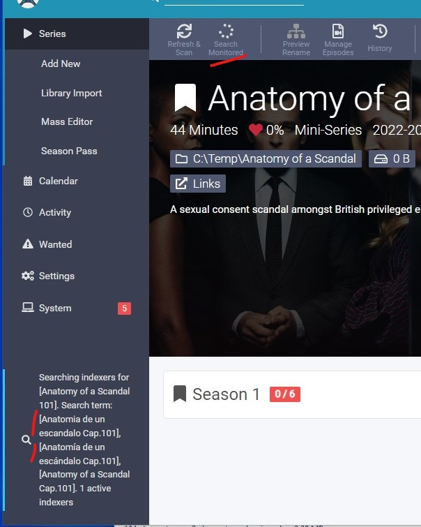
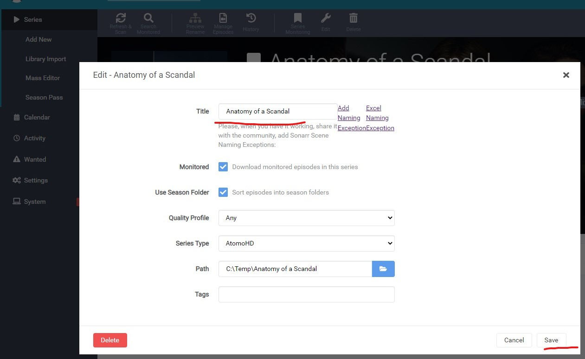

# Modified version of sonarr for wolfmax4k, atomoHD, atomixHQ, sinsitio, eldesvandelverdugo, etc.
#### What does this?

It's an optimistic way to find episodes.
In Spain, the standard format S01E01 is not usually followed.
Will generate the following search format in jackett in **episodes mode**:

| Example | Format | Force spanish language | Sites
| ------------- | ------------- | ------------- | ------------- |
| Mandalorean Cap.201 | {Series.Title} Cap.{SeasonNumber:0}{EpisodeNumber:00} | N |https://wolfmax4k.com/ https://atomohd.skin/ https://pediatorrent.com/
| Mandalorean 2x1 | {Series.Title} {SeasonNumber:0}x{EpisodeNumber:0} |  Y | https://www.sinsitio.site/
| Mandalorean 2x01 | {Series.Title} {SeasonNumber:0}x{EpisodeNumber:00}  | Y | Telegram Groups
| Mandalorean S02E01 | {Series.Title} S{SeasonNumber:00}E{EpisodeNumber:00}  | N | Standard format

Will generate the following search format in jackett in **season mode**:

| Example | Format | Force spanish language | Sites
| ------------- | ------------- | ------------- | ------------- |
| Mandalorean T2 | {Series.Title} T{SeasonNumber:0} | N |
| Mandalorean T 2 | {Series.Title} T {SeasonNumber:0}   | N |
| Mandalorean T02 | {Series.Title} T{SeasonNumber:00}   | N |
| Mandalorean S02 | {Series.Title} S{SeasonNumber:00} | N | Standard format

#### How to use?
Serie type: "atomoHD"


#### Can't find the series?

Search monitored and make sure that sonarr has the correct title in Spanish:


The title field is enabled, you can manually add search terms:


You can send the translation to sonarr, so that other users have it:


#### Is there something else?

Two tasks added, to automate the search for new episodes
- Missing Episode Search (Wanted -> Missing) every 6 hours
- Cutoff Unmet Episode Search	(Wanted -> Cuttoff Unmet, monitored only) every 6 hours

#### How to use
1. I use portainer to create a new stack:

Stack name: test-sonnar-clear

Stack content:
```yaml
version: "2.1"
services:
  sonarr:
    image: lscr.io/linuxserver/sonarr:latest
    container_name: sonarr-clear
    environment:
      - PUID=1000
      - PGID=1000
      - TZ=Europe/London
    volumes:
      - /sonarr-clear/config:/config
      - /sonarr-clear/tvseries:/tv #optional
      - /sonarr-clear/downloadclient-downloads:/downloads #optional
    ports:
      - 8989:8989 
    restart: unless-stopped
```   
2. Open url sonar, ex: http://0.0.0.0:8989/, ok work.

3. Download patch: "patch_build_mono.zip" or build branch. [Download](patch_build_mono.zip)
```yaml
wget https://github.com/mercu01/Sonarr/raw/main-atomoHD/patch_build_mono.zip
``` 
4. Unzip the patch in "/sonarr-clear/patch/"
```yaml
sudo unzip ./patch_build_mono.zip -d /sonarr-clear/patch/
``` 
5. Change the Stack content created before:
```yaml
version: "2.1"
services:
  sonarr:
    image: lscr.io/linuxserver/sonarr:latest
    container_name: sonarr-clear
    environment:
      - PUID=1000
      - PGID=1000
      - TZ=Europe/London
    volumes:
      - /sonarr-clear/config:/config
      - /sonarr-clear/tvseries:/tv #optional
      - /sonarr-clear/downloadclient-downloads:/downloads #optional
      - type: bind
        source: /sonarr-clear/patch/UI
        target: /app/sonarr/bin/UI
      - type: bind
        source: /sonarr-clear/patch/Sonarr.Core.dll
        target: /app/sonarr/bin/Sonarr.Core.dll
      - type: bind
        source: /sonarr-clear/patch/Sonarr.Api.V3.dll
        target: /app/sonarr/bin/Sonarr.Api.V3.dll
      - type: bind
        source: /sonarr-clear/patch/Sonarr.Common.dll
        target: /app/sonarr/bin/Sonarr.Common.dll
    ports:
      - 8989:8989 
    restart: unless-stopped
``` 

#### Other example docker compose:
```yaml
  sonarr:
    image: linuxserver/sonarr
    container_name: sonarr
    networks:
      - default
    depends_on:
      - qbittorrent
      - jackett
    volumes:
      - /path/to/conf:/config
      - /path/to/tv:/tv
      - /path/to/downloads:/downloads
      - type: bind
        source: patch/UI
        target: /app/sonarr/bin/UI
      - type: bind
        source: patch/Sonarr.Core.dll
        target: /app/sonarr/bin/Sonarr.Core.dll
      - type: bind
        source: patch/Sonarr.Api.V3.dll
        target: /app/sonarr/bin/Sonarr.Api.V3.dll
      - type: bind
        source: patch/Sonarr.Common.dll
        target: /app/sonarr/bin/Sonarr.Common.dll
    ports:
      - 8989:8989
    restart: unless-stopped
    environment:
      - UMASK_SET=022 #optional
      - PUID=1000
      - PGID=1000
```
#### Tips 

- Jackett best indexers: 
  - **BTDigg** (need config flaresolverr in jacket)
  - Solid torrents
  - Bitsearch
  - Torrentz2nz
- Sonarr setting - Profile - Language: **Spanish**
- Sonarr setting - Profile - Quality profiles: WEB 1080p
- Sonarr setting - Media Management - Standard and anime Episode Format: "{Series Title} - S{season:00}E{episode:00} - {Episode Title} - {Quality Full} - {season:0}x{episode:00} - audio {MediaInfo AudioLanguages} - sub {MediaInfo SubtitleLanguages}"

#### Extra Tips

##### Qbittorrent:

Many times, the torrents are in RAR format.

There is a trick to automate these torrents:

In qbittorrent set "autorun enable":
```yaml
/config/torrentUnrar.sh "%F" "%L" "%N"
```
Copy the [following](torrentUnrar.sh) .sh to somewhere accessible to qbittorent, for example /config/

##### What the hell is this sh doing?
1. Extract the rar to the folder /downloads/temp-unrar/***TORRENT NAME***/
2. When finished, move the unzipped files back to the folder where the rar is. In a '/unrar' subdirectory.
3. Maintenance, finds all /unrar folders and deletes them when they are older than 24h


-----------------------------------

# </img> Sonarr 

Sonarr is a PVR for Usenet and BitTorrent users. It can monitor multiple RSS feeds for new episodes of your favorite shows and will grab, sort and rename them. It can also be configured to automatically upgrade the quality of files already downloaded when a better quality format becomes available.

## Getting Started

- [Download/Installation](https://sonarr.tv/#downloads-v3)
- [FAQ](https://wiki.servarr.com/sonarr/faq)
- [Wiki](https://wiki.servarr.com/Sonarr)
- [(WIP) API Documentation](https://github.com/Sonarr/Sonarr/wiki/API)
- [Donate](https://sonarr.tv/donate)

## Support
Note: GitHub Issues are for Bugs and Feature Requests Only

- [Forums](https://forums.sonarr.tv/)
- [Discord](https://discord.gg/M6BvZn5)
- [GitHub - Bugs and Feature Requests Only](https://github.com/Sonarr/Sonarr/issues)
- [IRC](https://web.libera.chat/?channels=#sonarr)
- [Reddit](https://www.reddit.com/r/sonarr)
- [Wiki](https://wiki.servarr.com/sonarr)


## Features

### Current Features

- Support for major platforms: Windows, Linux, macOS, Raspberry Pi, etc.
- Automatically detects new episodes
- Can scan your existing library and download any missing episodes
- Can watch for better quality of the episodes you already have and do an automatic upgrade. *eg. from DVD to Blu-Ray*
- Automatic failed download handling will try another release if one fails
- Manual search so you can pick any release or to see why a release was not downloaded automatically
- Fully configurable episode renaming
- Full integration with SABnzbd and NZBGet
- Full integration with Kodi, Plex (notification, library update, metadata)
- Full support for specials and multi-episode releases
- And a beautiful UI

## Contributing

### Development
This project exists thanks to all the people who contribute. [Contribute](CONTRIBUTING.md).

<a href="https://github.com/Sonarr/Sonarr/graphs/contributors"></a>

### Supporters

This project would not be possible without the support of our users and software providers. 
[**Become a sponsor or backer**](https://opencollective.com/sonarr) to help us out!

#### Mega Sponsors

[](https://opencollective.com/sonarr/contribute/mega-sponsor-21443/checkout)

#### Sponsors

[](https://opencollective.com/sonarr/contribute/sponsor-21457/checkout)

#### Backers

[](https://opencollective.com/sonarr/contribute/backer-21442/checkout)

#### JetBrains

Thank you to [ JetBrains](http://www.jetbrains.com/) for providing us with free licenses to their great tools

* [ TeamCity](http://www.jetbrains.com/teamcity/)
* [ ReSharper](http://www.jetbrains.com/resharper/)
* [ dotTrace](http://www.jetbrains.com/dottrace/)

### Licenses

- [GNU GPL v3](http://www.gnu.org/licenses/gpl.html)	
- Copyright 2010-2021
